Assembly
===========

Install the base of Rollarm
-----------------------------

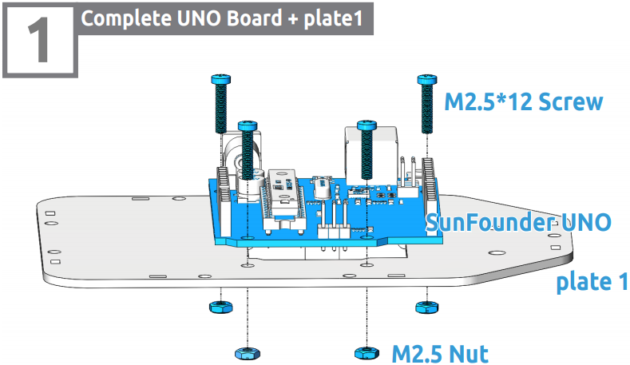

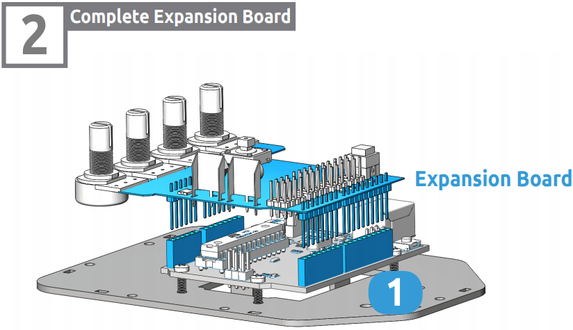

.. image:: img/media20.png

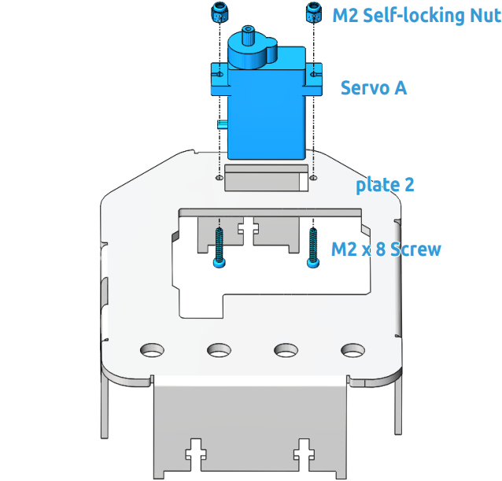

.. note::
    You can turn the wrench clockwise to tighten the selflocking nut.

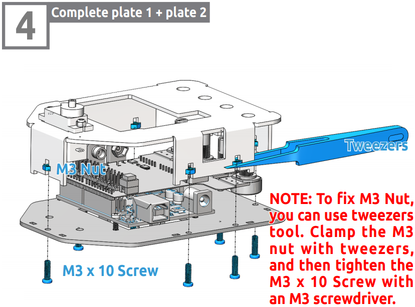

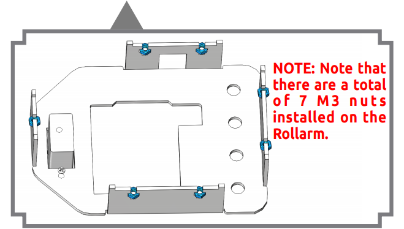

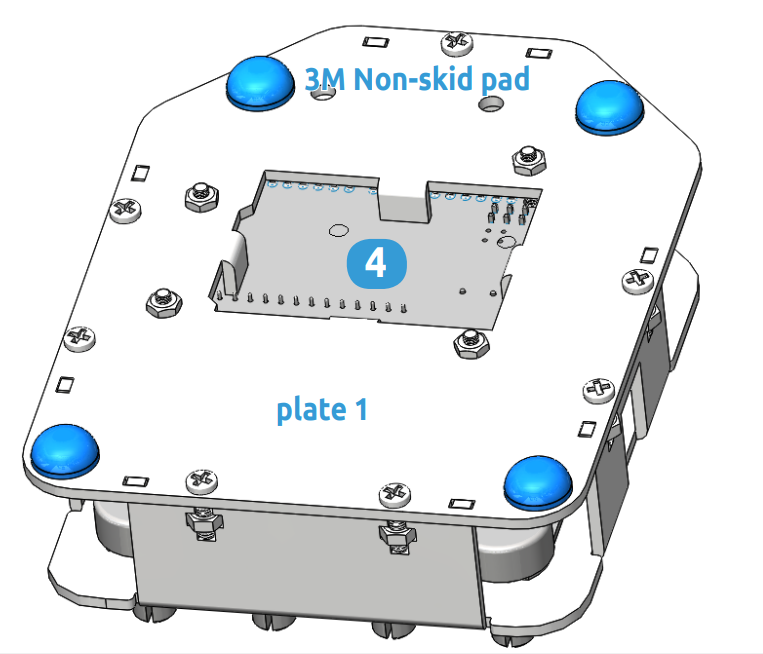

Install Accessories
------------------------

.. image:: img/media26.png

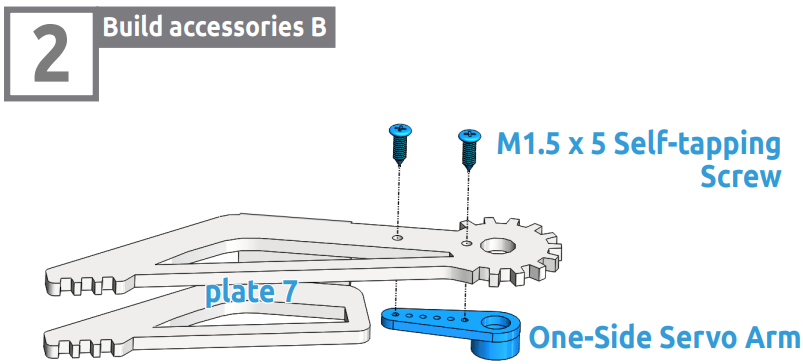

Calibrate the steering gear angle
-----------------------------------

.. warning::
    Before installing the rocker arms for each servo, you need to adjust the servo. If you skip this step and finish assembling and power the product, the servo may appear to block or be damaged, you may even need to disassemble the robot from this step to reassemble it!
	
**Step 1:** Prepare four white servos, and then insert the Servo A wires into D4, Insert the Servo B wires into D5, Insert the Servo C wires into D6, Insert the Servo D wires into D7.

.. image:: img/media28.png

.. image:: img/media29.png

**Step 2:** connect the Servo Control Board to the PC via the USB Type-B Cable, and the PC will automatically install the driver.

**Step 3:** Go to the folder DIY Control Robot Arm kit for Arduino-Rollarm/Arduino Code/Servo and open the file Servo.ino.

.. image:: img/media30.png

**Step 4:** Select the **Board.**

.. image:: img/media31.png

and **Port**

.. image:: img/media32.png

**Step 5:** Click **Upload.**

.. image:: img/media33.png

After the upload is completed successfully, keep the USB cable connecting. You may hear the sound of gear moving (or may not, if the servo shaft happens to be at 90 degrees at the beginning; but you GENTLY spin the rocker arm and you’ll find it’s unmovable). So now the servo is adjusted to 90 degrees.

Install Servo Rocker Arm
----------------------------

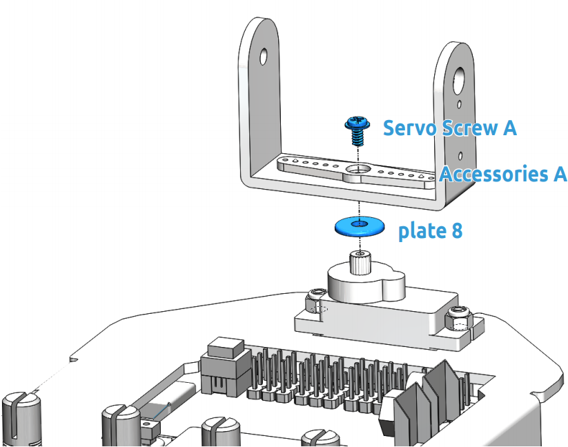

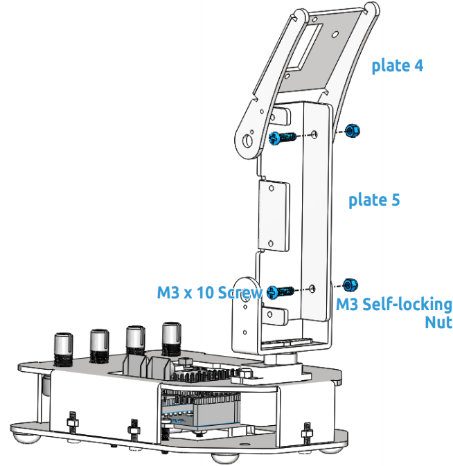

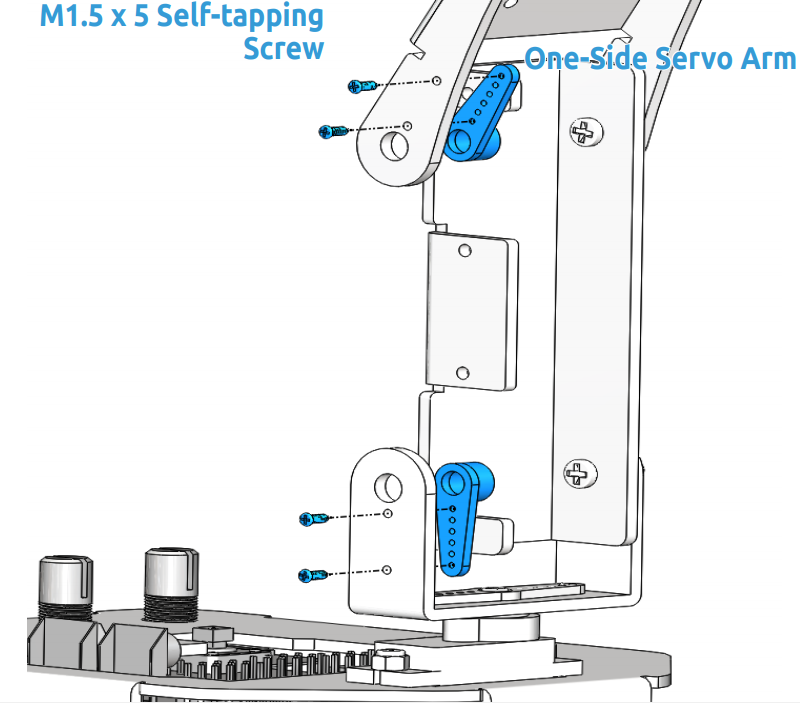

.. image:: img/media41.png

.. note::
    In this step, please keep the control board power on, Rotate plate 4 to a 90 degree angle with plate 5.
	
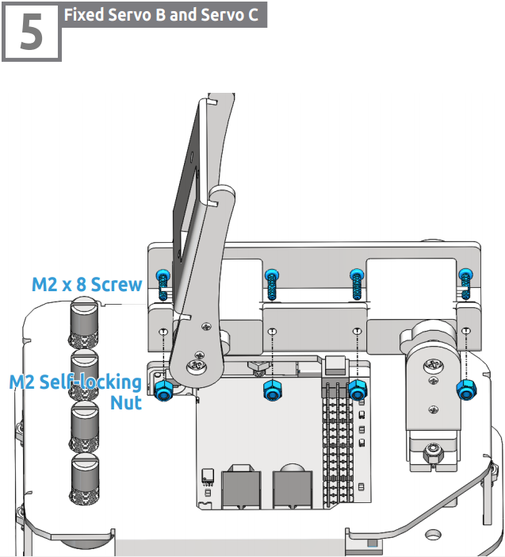

.. note::
    In this step, please temporarily turn off the power of the control board, and then rotate the plate 5 to an appropriate angle to fix the servo. Similarly, use a spanner to tighten these M2 self-locking nuts.

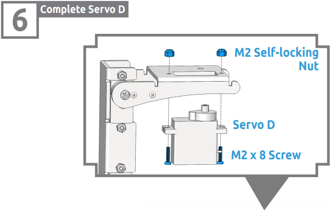

.. note::
    Use a spanner to tighten these M2 self-locking nuts.

.. image:: img/media45.png

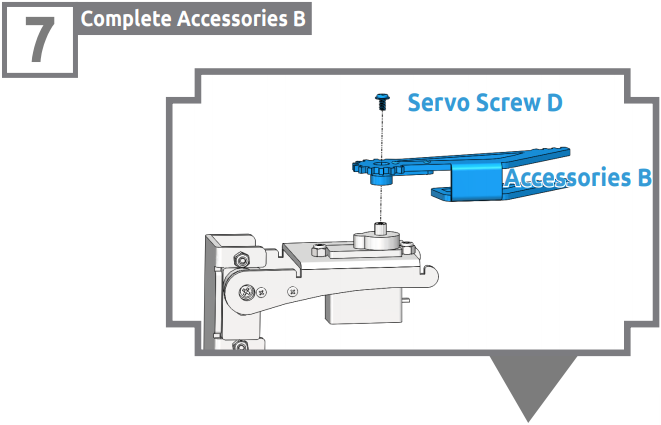

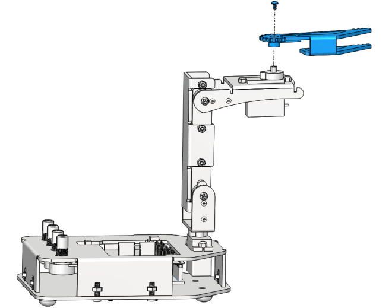

.. note::
    Power on the control board again in this step. Keep the gripper edge of the plate 7 parallel to the side of the plate 4.

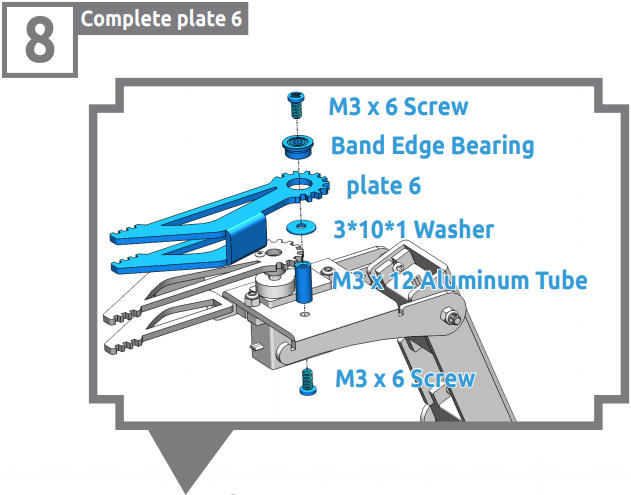

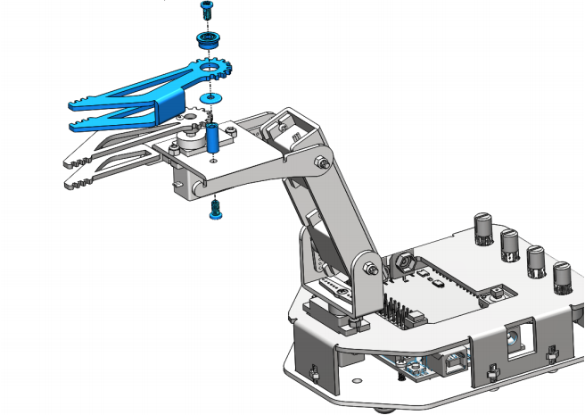

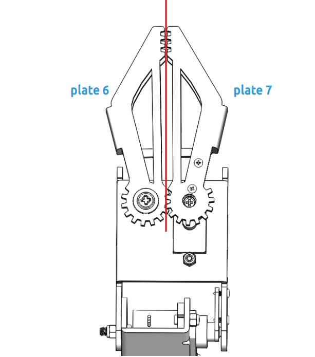

.. note::
    Make sure that the inner sides of the plate 6 and plate 7 are parallel and the gears meshed.
	
Install Button
-----------------

Please print the **scale.dwg** file **in a 1:1 ratio**. After the printed scale paper is cut, place the paper on plate 2.

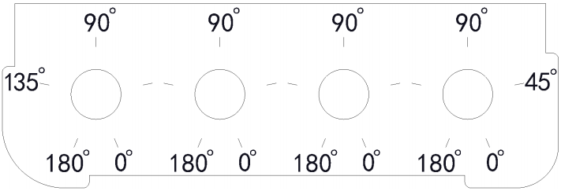

.. note::
    It is recommended to use AutoCad software for printing.
	
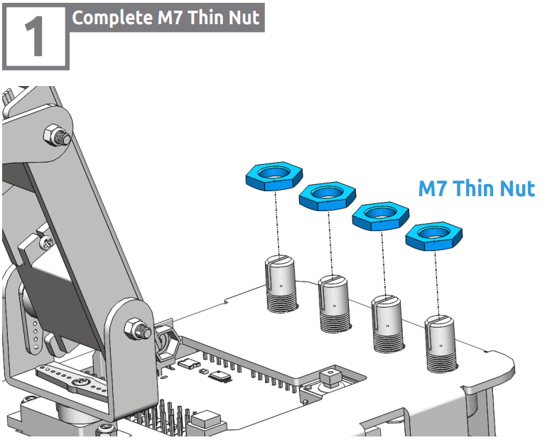

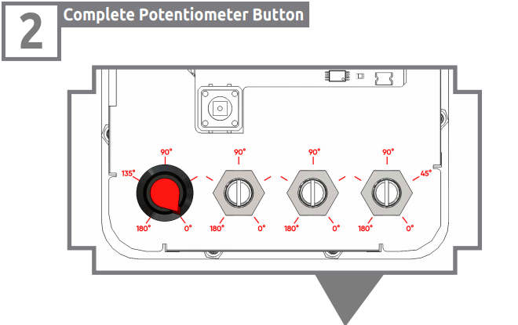

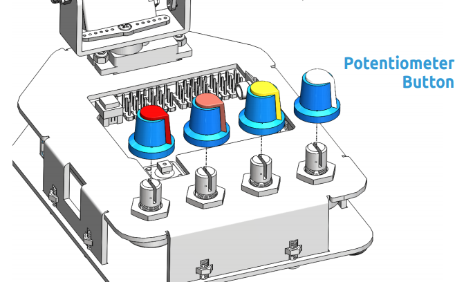

.. note::
    Align the bulged part of button with the 0° position.Rotate the potentiometer clockwise to the end, and put the button onto the potentiometer and press to tighten them.
	
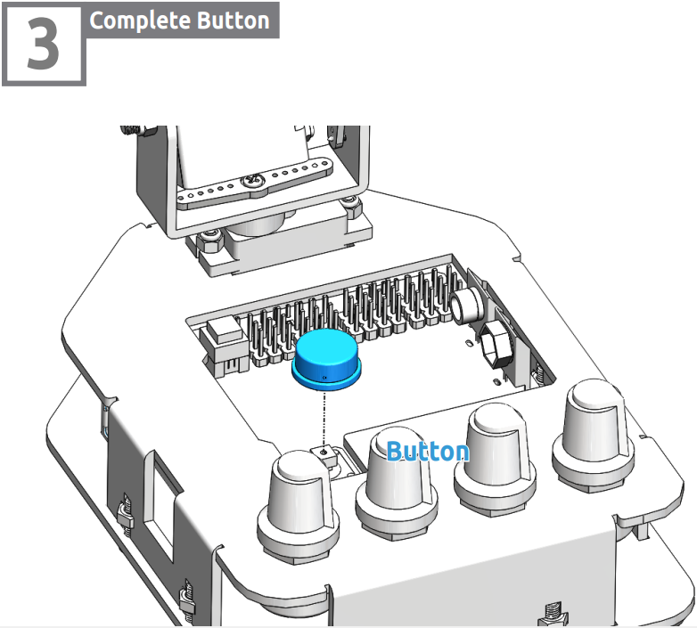

Install Battery
-----------------

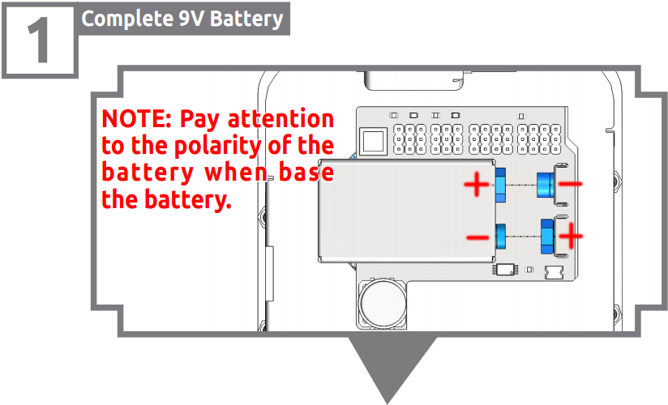

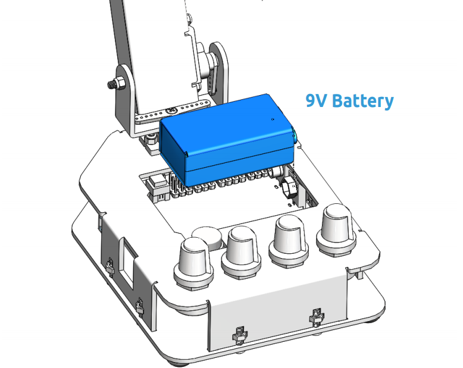

	