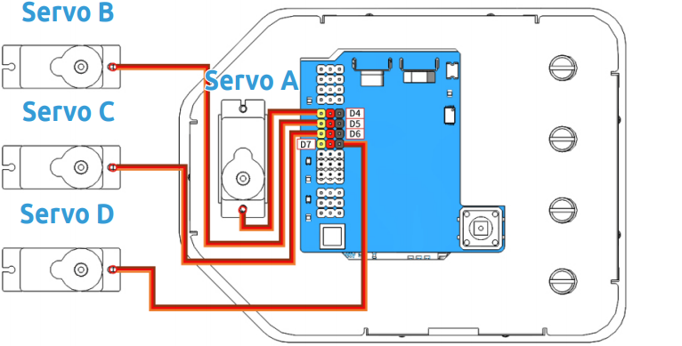
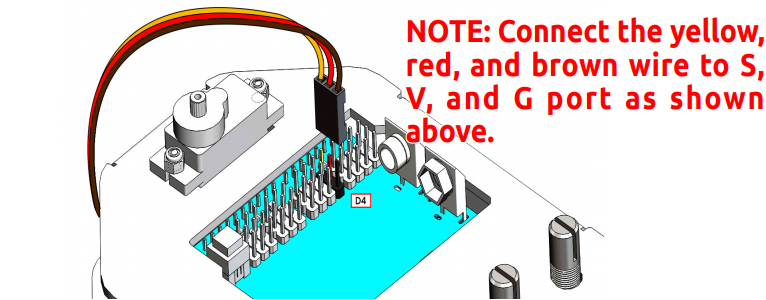
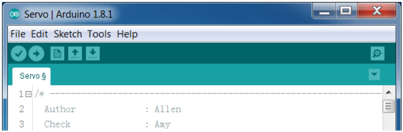
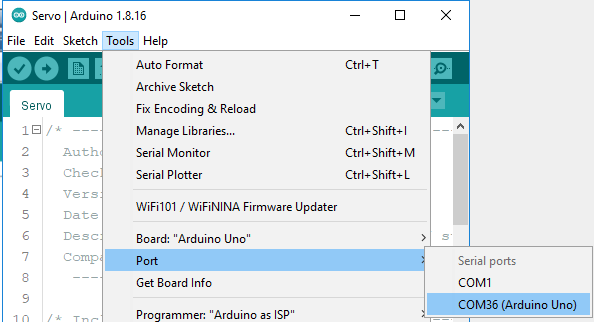
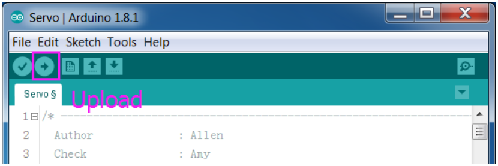

Calibrate the Servo Angle
---------------------------

.. warning::

    You will need to write a specific angle to the Servo before you install the Servo arm for each Servo. If you skip this step, complete the assembly and power up the Servos, they may become blocked or damaged, and you may even need to disassemble the robot and reassemble the Servo parts.

**Step 1**: Take out the 4 Servos and label them A, B, C and D. Connect them to D4-D7 to distinguish them later.

* Servo A is connected to D4
* Servo B is connected to D5
* Servo C is connected to D6
* Servo D is connected to D7

Now start uploading code to SunFounder R3 Board, this step is a one-time action, you don't need to upload the code again during the assembly process.

**Step 2**: Connect the SunFounder R3 Board to your PC with the USB Type B cable that comes with the kit, the computer will usually recognize your board automatically and finally assign a port.

**Step 3**: Go to the folder ``DIY Control Robot Arm kit for Arduino-Rollarm/Arduino Code/Servo`` and open the file ``Servo.ino``, make sure you have :ref:`Download the Code`.

**Step 4:** Select the **Board**.

.. image:: img/media31.png

and **Port**, your port may not be the same as mine.

**Step 5:** Click **Upload.**

After the upload is completed successfully, you may hear the sound of gear moving (or may not, if the Servo shaft happens to be at 90 degrees at the beginning; but you GENTLY spin the Servo arm and you’ll find it’s unmovable). So now the Servo is adjusted to 90 degrees.

.. note::

    * After uploading the code this time, you can unplug the Type B cable and use the battery directly or plug the Type B cable directly into the power socket, the code on the SunFounder R3 board will run again, no need to burn the code from Arduino IDE again.
    * Don't force to turn the Servo when power is on, so as not to damage it.
    * It is recommended that when assembling the Servo, you can unplug the other Servo cables so that you can have a better mounting position.

Now you can continue assembling Rollarm.