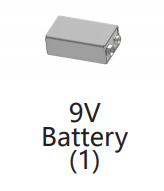

Component List and Assembly Instructions
===================================================

Before assembling the Rollarm, please first verify that all parts and components have been included. If there are any missing or damaged components, please contact SunFounder immediately at cs@sunfounder.com to resolve the issue as soon as possible.

Please follow the steps on the following PDF for assembly instructions: 

* :download:`[PDF]Component List and Assembly of Rollarm <https://github.com/sunfounder/sf-pdf/raw/master/assembly_file/a0000775-rollarm.pdf>`

.. note::

    * If the Servo is already powered up, do not force the Servo shaft to avoid damaging the Servo.
    * Before assembling, you need to buy 1 9V battery and fully charge them.
    * The Expansion Board cannot charge the battery, so you need to buy a battery charger at the same time.

Self-Provided Components
---------------------------

