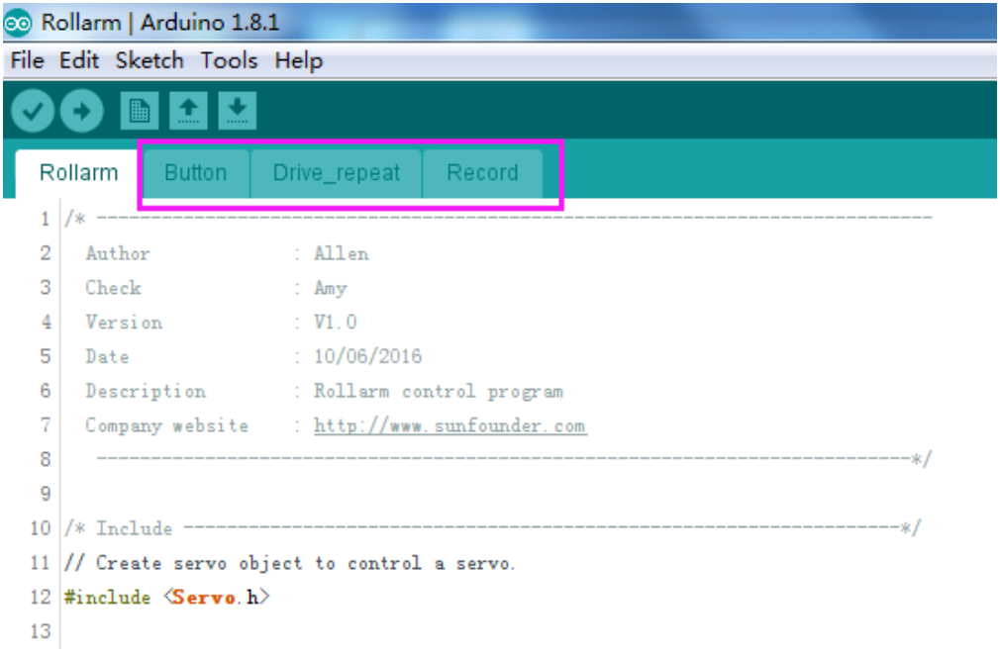
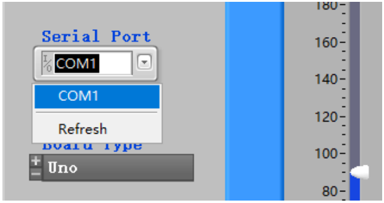
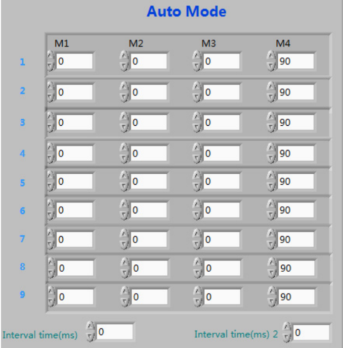

FAQ
======

About the Assembly
----------------------

**Q1:** After assembly and program download, the Rollarm’s four axes are in wired position, some maybe out of control. What should I do? 

**A:** Remember to power on and calibrate each Servo before assembly.

About the Arduino code control
----------------------------------

**Q1:** When I open a program, it prompts me that a new folder should be created. After I click Yes and a new folder is created, the main program reports an error when I want to open the main program. What’s going wrong?

**A:** DO NOT open these subprograms under Arduino code\\Rollarm separately:

.. image:: img/media79.png

If you open the subprograms separately, a dialog box will pop up like this:

.. image:: img/media80.png

If a new folder has been created for the subprogram, please cut the subprogram file to the original directory Arduino code\\Rollarm. Reopen the main program:

.. image:: img/media81.png

If a new folder has been created for the subprogram, please cut the subprogram file to the original directory Arduino code\\Rollarm. Reopen the main program:

About the Labview software control
-------------------------------------

**Q1:** After powering on the Rollarm, why do the Servos shake a little when there’s no movement at all?

**A:** There may be something wrong with the Serial Port. For instance, the following condition may appear:

Turn off the Rollarm, power it on again, and reconnect the serial port to try.

**Q1:** The Rollarm is in a strange position when I click **Start** and it’s in the automatic mode. Anything wrong?

**A:** Here no values is filled in the table yet. The first three axes are in 0°, and the last one is in 90°. You need to fill the correct value of the rotating angle first, and click **Start** to run.

Before clicking **Start**, you need to fill in the rotating angle for each axis in different steps, and the interval time between steps. If you don’t know the exact angle, you can shift to the manual mode and note down the angle values for each step, and then shift back to fill in. When all the steps above are done, you can click **Start** to let Rollarm perform the automatic control.
