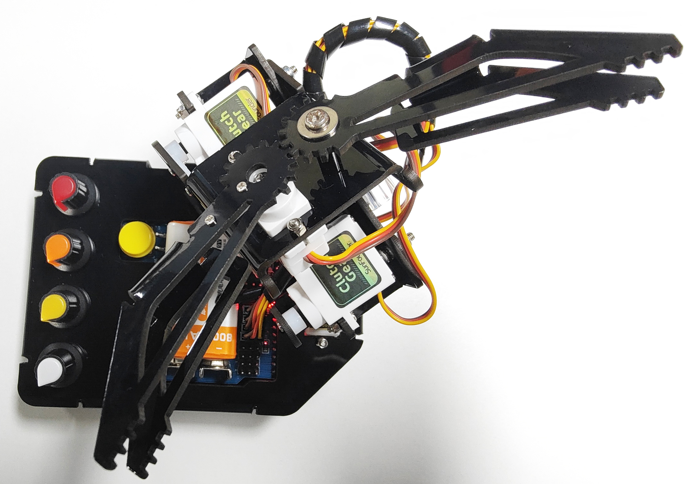
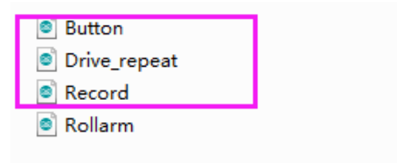
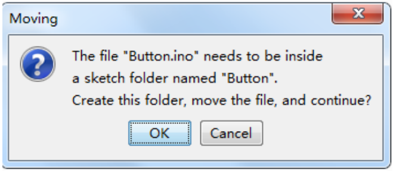
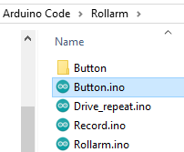

FAQ
======

About the Assembly
----------------------

**Q1:** After assembly and program download, the Rollarm’s four axes are in wired position, some maybe out of control. What should I do? 

* Remember to power on and calibrate each Servo before assembly, please refer to :ref:`Calibrate the Servo Angle`.
* If it has been calibrated, but after running ``Rollarm.ino``, it is at the angle shown below, but if you screw all 4 potentiometers to the forward-facing position and can return to the way it was just assembled, it is normal.

About the Arduino Code Control
----------------------------------

**Q1:** When I open a program, it prompts me that a new folder should be created. After I click Yes and a new folder is created, the main program reports an error when I want to open the main program. What’s going wrong?

**A:** DO NOT open these subprograms under ``Arduino code\\Rollarm`` separately:

If you open the subprograms separately, a window will pop up like this:

If a new folder has been created for the subprogram, please cut the subprogram file to the original directory ``Arduino code\\Rollarm``. Reopen the main program:

