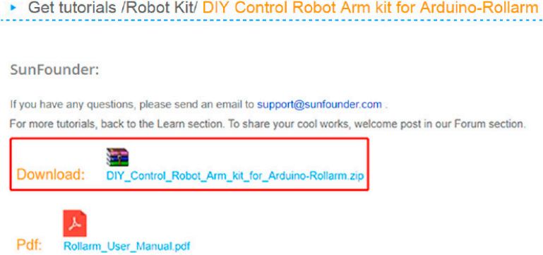
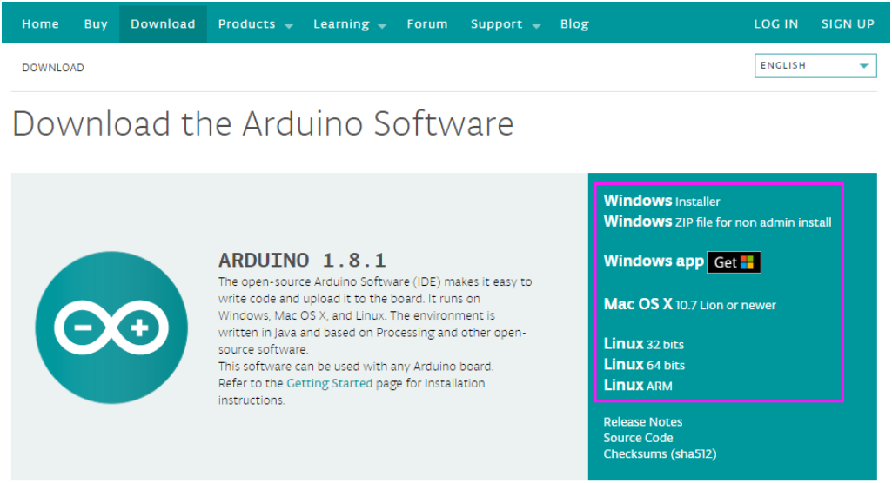
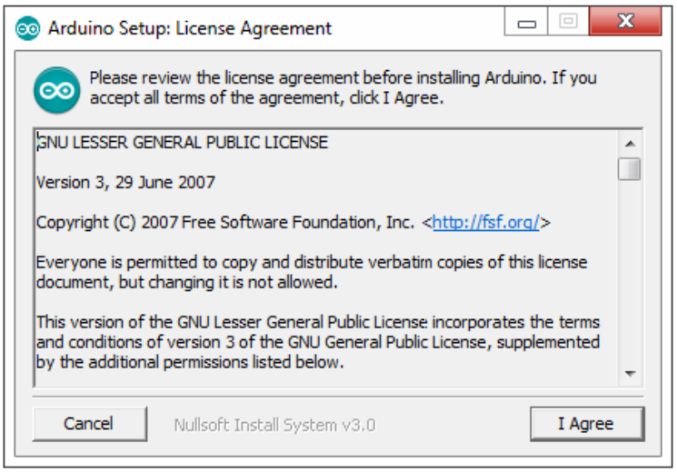
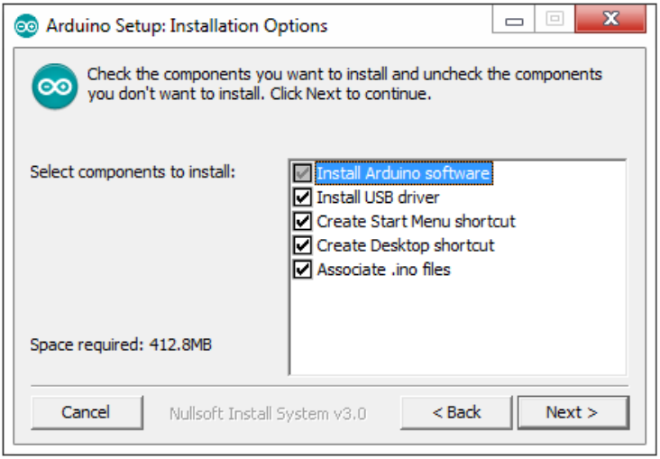
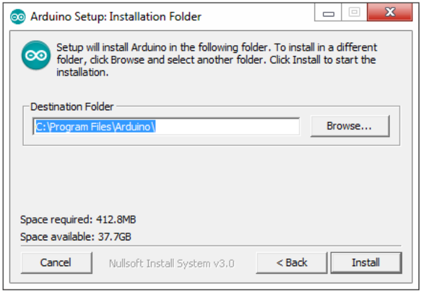
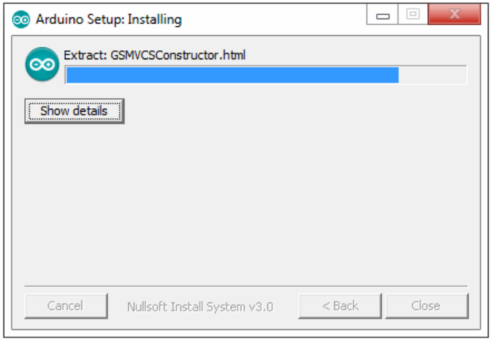
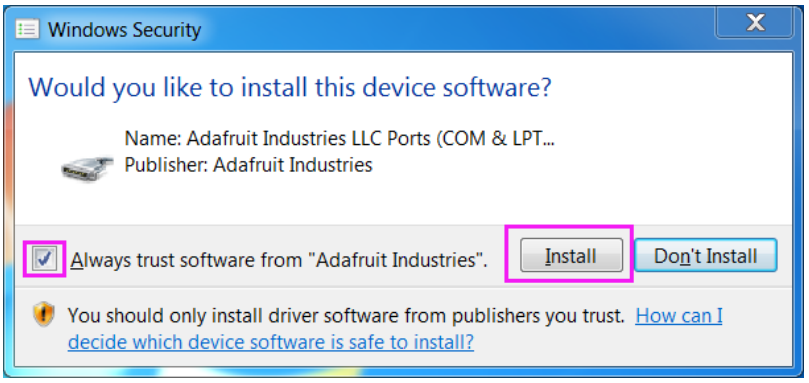
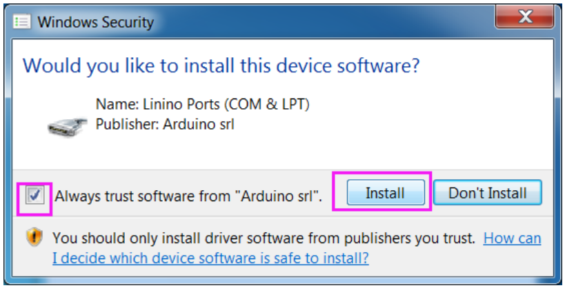
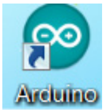

Getting Started with Software
===============================

Downloading Codes
-------------------

Go to **Learn->Robot Kit->DIY Control Robot Arm kit for Arduino-Rollarm** and download the package

Install Arduino IDE
---------------------

Arduino is an open source platform that applies simple software and hardware. You can get it in a short even when you know little of it. It provides an integrated development environment (IDE) for code editing and compiling, compatible with multiple control boards. So you can just download the Arduino IDE, upload the sketches (i.e. the code files) to the board, and then you can see experimental phenomena. For more information, refer to http://www.arduino.cc. 

The code in this kit is written based on Arduino, so you need to install the IDE first. Skip it if you have done this.

**Step 1:** Go to the arduino.cc website and click Download. On the page, check the software list on the right side under Download the Arduino Software.

Find the one that suits your operation system and click to download. There are two versions of Arduino for Windows: Installer or ZIP file. You’re recommended to download the former.

**Step 2:** Double click the exe. file and the following window will show up. Click I Agree. The following interface will show up.

Choose **Next**.

Click **Browse** to choose the installation path or enter a directory at the Destination Folder.

Click **Install**.

The following interface will show up.

.. note::
    After the installing progress bar goes to the end, the Close button may be enabled for some PC. Just click it to complete the installation.
	

Then a prompt appears. Select Always trust software for \"Adafruit Industries\" and click Install.

Select \"Always trust software for Arduino srl\" and click **Install**.

After the installation is done, click **Close**. Then an Arduino icon will appear on the desktop: 

