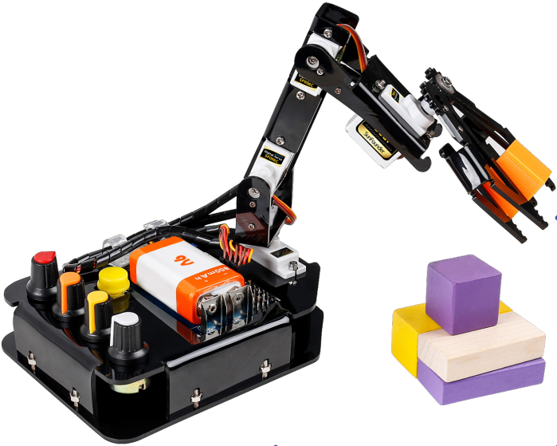

Rollarm for Arduino
============================

The Rollarm Kit is an interesting and useful learning tool for Arduino and robot hobbyists. With the structural plate and code based on Arduino, it enables users to learn programming from easy to difficult, control the mechanical arm freely and perform various fun operations! 

This fun mechanical arm consists of 4 axes, each controlled by a Servo. Powered by a 9V battery, the control systems is composed of SunFounder Uno board, Servo extension board with remote control. The kit includes all necessary components like structural plate, circuit boards, and connector parts.

Now let’s go to get the fun!

If you have any questions, please send an email to service@sunfounder.com and we’ll reply as soon as possible.

**Content**

.. toctree::
    :maxdepth: 2

    components
    install_ide
    calibrate
    control_the_rollarm
    faq
    thank-robot

Copyright Notice
--------------------------

All contents including but not limited to texts, images, and code in this manual are owned by the SunFounder Company. You should only use it for personal study,investigation, enjoyment, or other non-commercial or nonprofit purposes, under therelated regulations and copyrights laws, without infringing the legal rights of the author and relevant right holders. For any individual or organization that uses these for commercial profit without permission, the Company reserves the right to take legal action.

