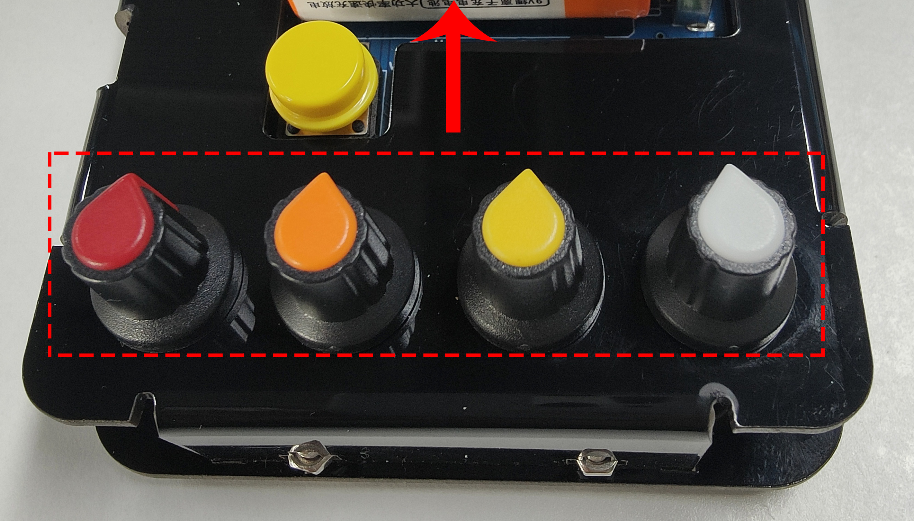
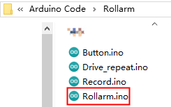
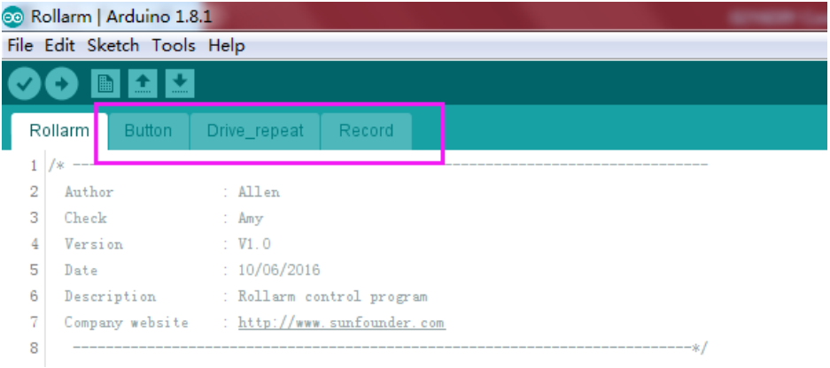
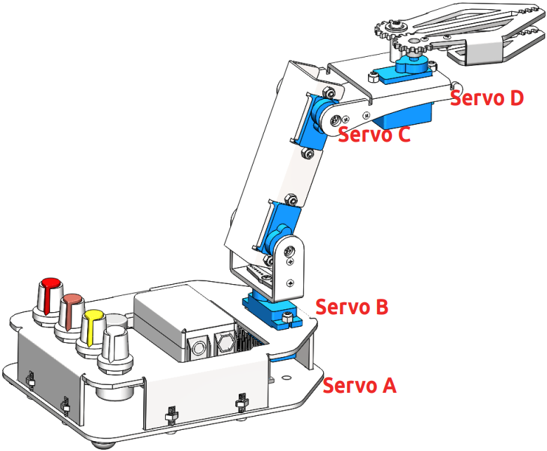
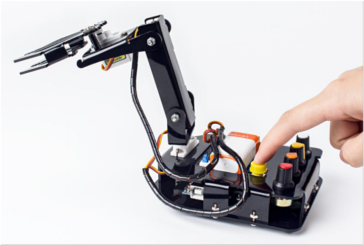

Manual Control
=====================

**Step 1**

First rotate the 4 potentiometers of the Rollarm to the forward facing position, in order to keep the Rollarm as it was just assembled after uploading the code below.

**Step 2**

Run the ``Rollarm.ino`` code under the path ``DIY Control Robot Arm kit for Arduino-Rollarm\\Arduino Code\\Rollarm``. There are four code files in Rollarm, ``Rollarm.ino`` is the main program, when the others are subprograms.

When you open the main program, the subprograms will be opened automatically：

**Step 3**

Select the corresponding board and port, then click **Upload**.

**Step 4**

After the code upload, turn the power switch on, then we can try to control the Rollarm.

* **White** potentiometer to control the **Servo D** 
* The **yellow** potentiometer to control **Servo C** 
* The **orange** potentiometer to control **Servo B** 
* The **red** potentiometer to control **Servo A**

Record behavior
----------------------

Also ``Rollarm.ino`` has the function of recording actions, now look at how to use this function.

* Rotate a potentiometer to control a Servo to the desired position.
* Record this step by pressing the **yellow button** shortly.
* You can record as many steps as you like, up to a maximum of 100.
* Now press and hold the **yellow button** to get Rollarm to resume the recorded steps.

Code Explanation
---------------------------

Since the Rollarm has four Servos acting as the moving joint, we need to include a header file for driving the Servos and define them. 

.. code-block:: c

	//Create Servo object to control a Servo.
	#include <Servo.h>
	
	Servo Servo_0;
	Servo Servo_1;
	Servo Servo_2;
	Servo Servo_3;
	
After defining the function of driving the Servos, we need to read the analog value of the potentiometers and convert them into the rotating angle of the Servos.

.. code-block:: c

	//Read the values ot the potentiometers.
	void ReadPot()
	{
		SensVal[0] = 0;
		SensVal[1] = 0;
		SensVal[2] = 0;
		SensVal[3] = 0;
		
		SensVal[0] = analogRead(A0);
		SensVal[1] = analogRead(A1);
		SensVal[2] = analogRead(A2);
		SensVal[3] = analogRead(A3);
	}
	
	//The value of the potentiometer is matched to the angle value.
	void Mapping0()
	{
		SensVal[0] = map(SensVal[0], 0, 1023, 10, 170);
		SensVal[1] = map(SensVal[1], 0, 1023, 10, 170);
		SensVal[2] = map(SensVal[2], 0, 1023, 10, 170);
		SensVal[3] = map(SensVal[3], 0, 1023, 100, 180);
	}
	
After compiling the program, we need to make Rollarm remember the steps, which is done through pressing the button. 

.. code-block:: c

	//Calculate the time the button pressed
	void Button()
	{
		if (digitalRead(3) == 0)
		{
			delay(10);
			if (digitalRead(3) == 0)
			{
				KeyValue = 0;
				while (!digitalRead(3))
				{
					KeyValue++;
					delay(100);
				}
			}
		}
	}

We can tell which part of the code the Rollarm is performing by reading the value upon pressing the button. When the value is larger than 10, it means Rollarm is repeating the steps. When it is between 0 and 10, it means Rollarm is remembering. And when it is 0, it means Rollarm is being controlled by the potentiometers. The specific program is as follows: 

.. code-block:: c

	//Check the button.
	static int Flag = 1;
	Button();
	
	//The time of pressing the button is not long then record the action.
	if ((KeyValue < 10) && (KeyValue > 0))
	{
		KeyValue = 0;
		Record();
		Mapping1();
	}
	//Long press the button and open the auto mode,start repeating the action.
	else if (KeyValue > 10)
	{
		if (Flag == 1)
		{
			Flag = 0;
			Calculate();
		}
		Drive_init();
		delay(3000);
		for (int i = 1; i < Time; i++)
		{
			Drive_repeat(i);
			delay(500);
		}
	}
	//Did not press the button, open the manual mode.
	else
	{
		ReadPot();
		Mapping0();
		
Next, we are going to call the function to write the value of the Servo rotating angle. However, it is not merely about writing the values directly; the difference between two adjacent rotating values will also be written into the Servos. Here we take a Servo program for example.

.. code-block:: c

	//The first axis.
	if (Dif0[n] > 0)
	{
		for (int j = Joint0[n - 1]; j <= Joint0[n]; j++)
		{
			Servo_0.write(j);
			delay(10);
		}
	}
	else
	{
		for (int j = Joint0[n - 1]; j >= Joint0[n]; j--)
		{
			Servo_0.write(j);
			delay(10);
		}
	}