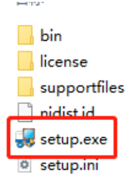
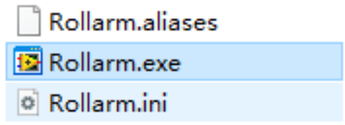
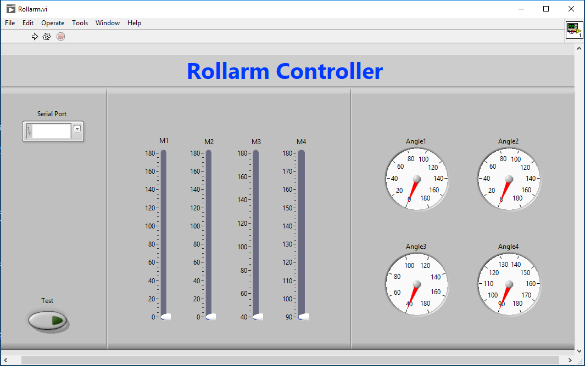

PC Control
========================

Rollarm can be controlled from your computer using a desktop application generated by `LabVIEW <https://www.ni.com/en-us/shop/labview.html>`_.

Using this app, you can control Rollarm to different postures and see the corresponding angle of each servo.

1. Add the Libraries
------------------------

Here we need to add LINX related libraries to ``Arduino/libraries``. 
LabVIEW LINX is an add-on to LabVIEW that adds the tools for development with Raspberry Pi, BeagleBoard and Arduino.

Go to the ``DIY_Control_Robot_Arm_kit_for_Arduino-Rollarm\Libraries`` path and copy all the folders.

    .. image:: img/linx5.png

Paste all the folders you just copied into the ``C:\Users\xxx\Documents\Arduino\libraries`` path.

    .. image:: img/linx6.png

The Arduino IDE uses this path by default to store user-added libraries. If yours isn't this path, go to **File** > **Preferences** to locate or change the location of your ``libraries/`` folder.

    .. image:: img/linx7.png

2. Run the Code
------------------------------

Open the ``.ino`` file in the ``DIY_Control_Robot_Arm_kit_for_Arduino-Rollarm\Arduino Code\Arduino_Uno_Serial`` path.

After selecting the correct board and port, upload it to the Arduino board.

    .. image:: img/linx8.png

3. Install the APP
-------------------------

Download the installation package.

* :download:`Rollarm-Labview <https://1drv.ms/u/s!AqKAi6T8L7jzkHieqfSKFHLtkg4d?e=8f755L>`

Unzip the file after downloading and double-click the ``install.exe`` file in the folder ``Volume`` to install it.

When the installation of this software is complete, locate **Rollarm** in the left corner of your computer to launch it. Or, go to the installation directory we just used and double-click ``Rollarm.exe`` to open it.
The default installation directory is: ``C:\\Program Files (x86)\Rollarm``.

The following interface will show up.

.. note::

    When you just open or stop the app, the following error message may appear, please click **Continue** to ignore it and continue the next steps.

    .. image:: img/linux1.png

4. Use the APP
-----------------------

Choose COM port, the same one you picked in the Arduino IDE.

    .. image:: img/linx1.png

Run this app.

    .. image:: img/linx2.png

You can test whether the app and Rollarm are communicating properly by clicking the Test button. The LED on pin 13 will light up when you click this button, which means the communication is working.

    .. image:: img/linx3.png

Now you can use M1~M4 to control Rollarm's 4 servos.

* M1: Control the Rollarm to turn left and right, the angle range is 0-180°.
* M2: Control the forward extension and retraction, the angle range is 0-180°.
* M3: Control the Rollarm's head up/down, the angle range is 40-180°.
* M4: Control the Rollarm open/close, the angle range is 90-180°.

    .. image:: img/linx4.png

