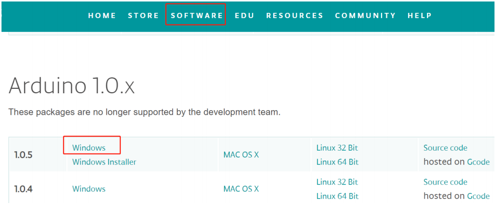
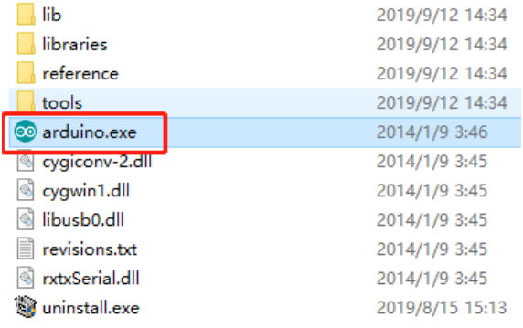

PC Control
-------------

Install Labview Software
~~~~~~~~~~~~~~~~~~~~~~~~~~~~~

For this kit, we use the Labview software for control on PC. If you have other better options, welcome to share by post under **Community** -> **FORUM** on our website www.sunfounder.com.

Download the Labview package in the link below:

https://s3.amazonaws.com/sunfounder/Arduino/Labview.zip

After downloading, open it and you will see the folder Rollarm’s Installer. Then find the setup file as shown below:

.. image:: img/media63.png

After the installation is done, in Start Menu, find Rollarm to open the Rollarm software. Or, enter the installation directory we used just now, and double click Rollarm.exe to open it. 
The defaulted installation directory is: C:\\Program Files (x86)\\Rollarm.

.. image:: img/media64.png

The following interface will show up.

.. image:: img/media65.png

Upload the Code
~~~~~~~~~~~~~~~~~~~

Before using the Rollarm Labview software, flash the control codes into the Rollarm robot, and the steps are as follows.

**Step 1:** In order to avoid the incompatibility, please download Arduino IDE 1.0.5 on Arduino official website: 

https://www.arduino.cc/en/Main/OldSoftwareReleases#previous

You are suggested to download zip version because zip version does not need installation and you can use it directly.

**Step 2:** After downloading and unzipping them, you need to double click the arduino.exe to open it.

**Step 3:** Click File- >Open, and you can find the LIFA_Base.ino on the path

DIY_Control_Robot_Arm_kit_for_Arduino-Rollarm.1\\Arduino Code\\LIFA_Base

And click to open.

.. image:: img/media68.png

**Step 4:** Choose the proper Board and Port, and upload the codes to the control board.

.. image:: img/media69.png

DO NOT unplug the USB cable at the moment.

Using the Software
~~~~~~~~~~~~~~~~~~~~

Back to the Rollarm Labview software, which includes two parts: **Manual** Mode and **Automatic** Mode.

**Manual Mode**

**Step1:** See the interface of manual control below. After the Labview is installed and run, this mode is enabled by default.

.. image:: img/media70.png

**Step2:** Click the inverted triangle icon for Serial Port, select the port according to you COM port. Here is COM24, which varies for different computers.

.. note::
    If you can only see COM1,to solve the problem, just replug the USB cable. Then start from sketch upload again.
	
.. image:: img/media71.png

**Step 3:** Select the **Board Type (Uno)** and **Connection Type(USB/Serial)**.

.. image:: img/media72.png

**Step 4:** There are **three** small icons at the top left. Click the middle on to run the software.

.. image:: img/media73.png

**Step5:** Click **Start**, and the button will change from dark to light **green**.

.. image:: img/media74.png

.. note::
    Sometimes you can see the mistakes like 5005 or 5002 that are as results of the software recognition failure of Arduino control board. Now, please click OK. Then there is a quick quiver state in Rollarm robot to return to the setting position. After that, you can continue to do your next step.
	
.. image:: img/media75.png

**Step 6: M1-M4 correspond to Servo1-Servo4**, you can move the slider control the 4 servo on the Rollarm.

.. image:: img/media76.png

.. image:: img/media77.png

**Automatic Mode**

You can also switch to **Auto Mode**. Fill the value of the rotating angle of the servos into the table under **Auto Mode** one by one. After filling the figures, click the **Start** button, then Rollarm will then perform as you just set.

**M1-M4:** Servo1-Servo4.

**1-9:** 9 groups of rotating angle.

**Interval times(ms):** The interval times between two groups, such as interval times between M4 in row 1 and M1 in row 2.

**Interval times(ms) 2:** The interval time between two rotating angles within a group.

.. note::
    the range of the data for Mode 4 is 90~180. Otherwise, it will be damaged due to stalling.

.. image:: img/media78.png

