PC Control
========================

Install Labview Software
--------------------------------

For this kit, we use the Labview software for control on PC, download the Labview package in the link below:

* :download:`Labview <https://s3.amazonaws.com/sunfounder/Arduino/Labview.zip>`

Once downloaded, unzip it and double-click the ``setup.exe`` file to install it.

.. image:: img/media63.png

After the installation is done, search for **Rollarm** at the bottom left of your computer to open this software. Or, enter the installation directory we used just now, and double click ``Rollarm.exe`` to open it. 
The defaulted installation directory is: ``C:\\Program Files (x86)\\Rollarm``.

.. image:: img/media64.png

The following interface will show up.

.. image:: img/media65.png

Upload the Code
------------------------

Before using the Rollarm Labview software, upload the control codes into the Rollarm robot, and the steps are as follows.

**Step 1**: In order to avoid the incompatibility, please use Arduino IDE 1.0.5.

* :download:`Arduino IDE 1.0.5 <https://github.com/sunfounder/DIY_Control_Robot_Arm_kit_for_Arduino-Rollarm/raw/master/arduino-1.0.5-r2.zip>`

**Step 2**: After downloading and unzipping, double click the ``arduino.exe`` to open it.

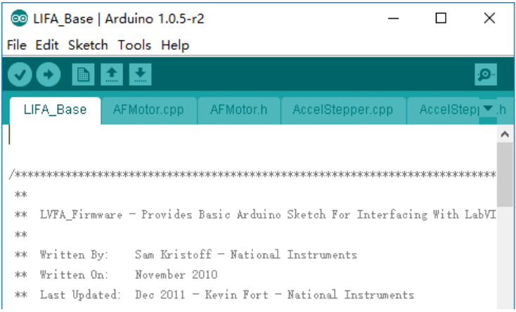

**Step 3**: Click **File** -> **Open**, go to the path where you downloaded the code, and open ``LIFA_Base.ino`` under the path of ``DIY_Control_Robot_Arm_kit_for_Arduino-Rollarm.1\\Arduino Code\LIFA_Base``.

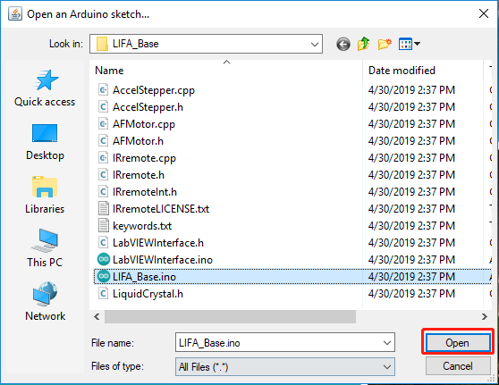

**Step 4:** Choose the proper Board and Port, and upload the code to the SunFounder R3 board. DO NOT unplug the USB cable at the moment.

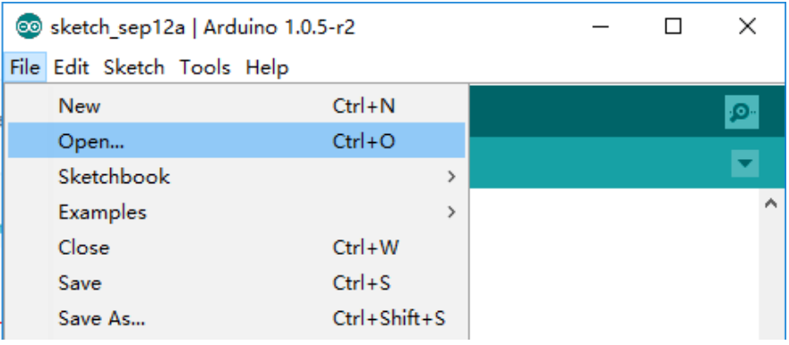

Using the Software
---------------------------

Back to the Rollarm Labview software, which includes two modes: **Manual Mode** and **Automatic Mode**.

**Manual Mode**

**Step1:** See the interface of manual control below. After the Labview is installed and run, this mode is enabled by default.

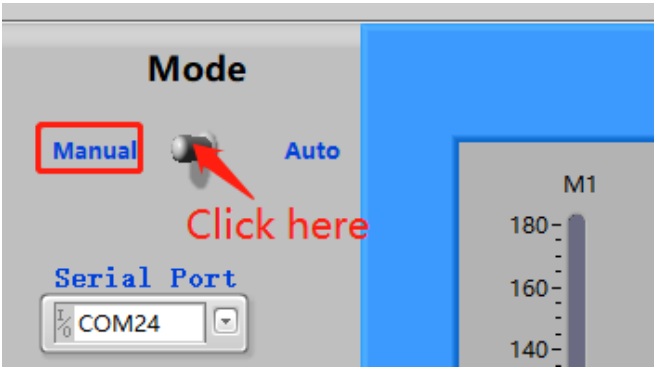

**Step2:** Click the inverted triangle icon for Serial Port, select the port according to you COM port. Here is COM24, which varies for different computers.

.. note::
    If you can only see COM1, to solve the problem, just replug the USB cable.

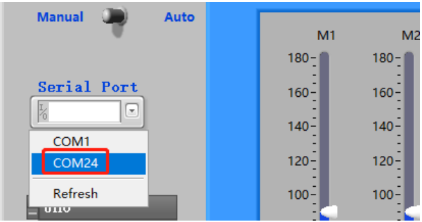

**Step 3:** Select the **Board Type (Uno)** and **Connection Type(USB/Serial)**.

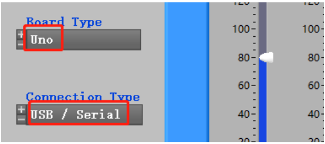

**Step 4:** There are **three** small icons at the top left, click the middle on to run the software.

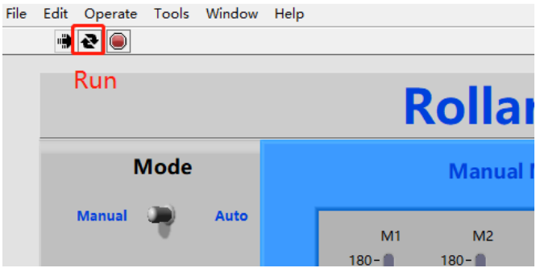

**Step5:** Click **Start**, and the button will change from dark to light **green**.

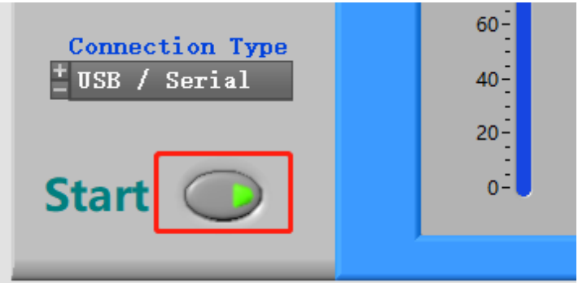

.. note::
    Sometimes you can see the mistakes like 5005 or 5002 that are as results of the software recognition failure of Arduino control board. Now, please click OK. Then there is a quick quiver state in Rollarm robot to return to the setting position. After that, you can continue to do your next step.
	
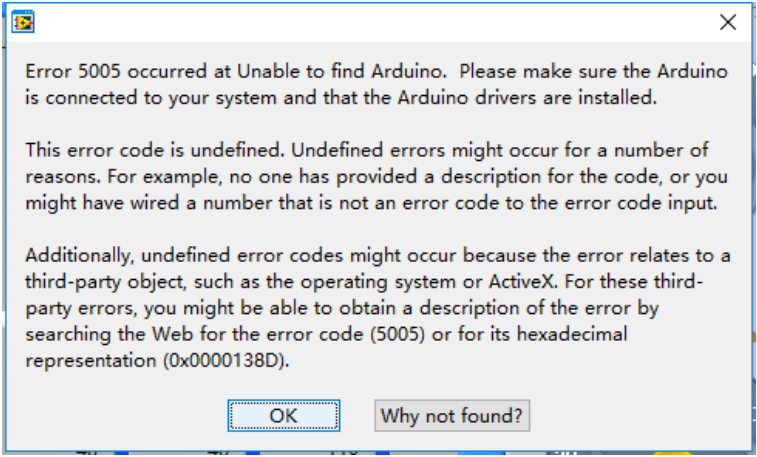

**Step 6: M1-M4 correspond to Servo1-Servo4**, you can move the slider to control the 4 Servos on the Rollarm.

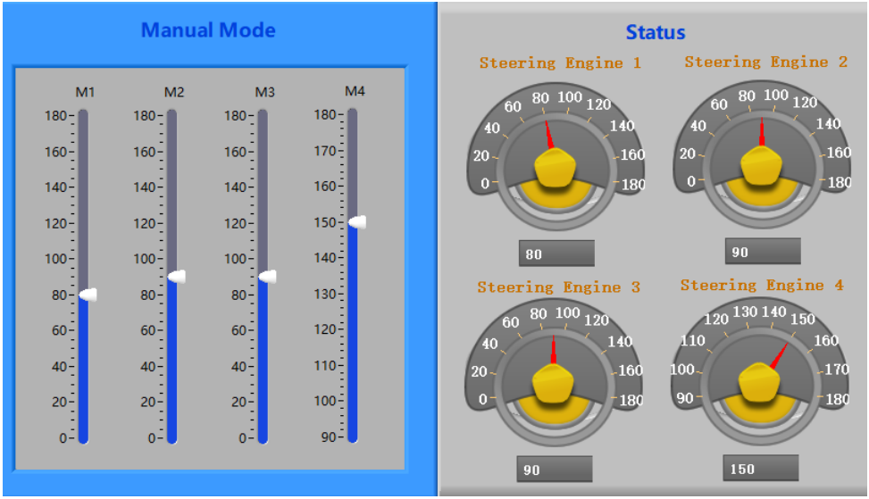

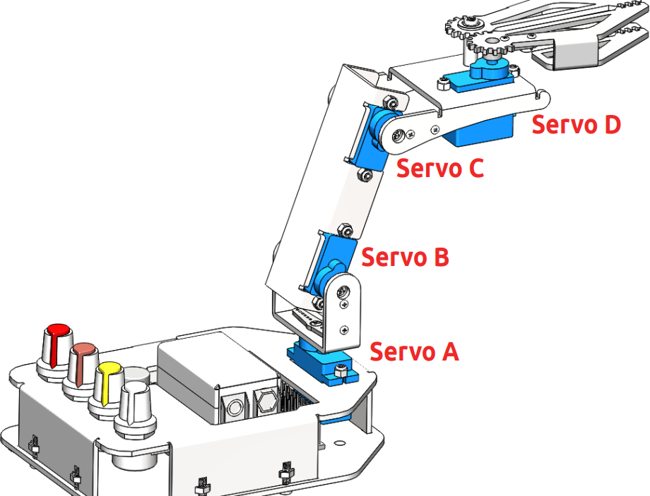

**Automatic Mode**

You can also switch to **Auto Mode**. Fill the angle of the Servos into the table under **Auto Mode** one by one. After filling the figures, click the **Start** button, then Rollarm will then perform as you just set.

* **M1-M4**: Servo1-Servo4.
* **1-9**: 9 groups of rotating angle.
* **Interval times(ms)**: The interval times between two groups, such as interval times between M4 in row 1 and M1 in row 2.
* **Interval times(ms) 2**: The interval time between two rotating angles within a group.

.. note::
    The range of the data for Mode 4 is 90~180. Otherwise, it will be damaged due to stalling.

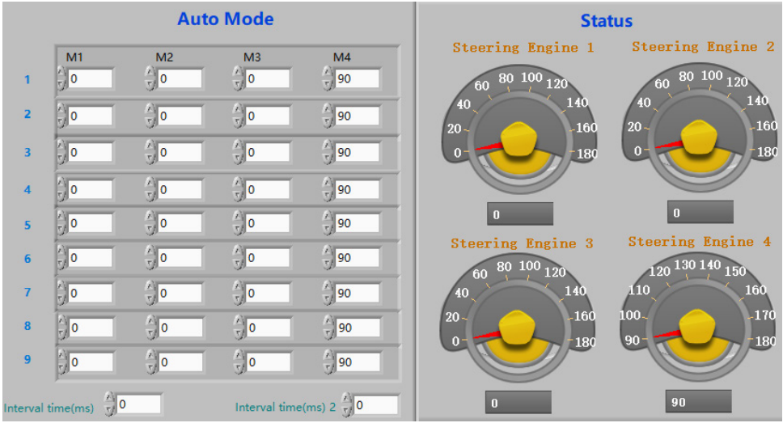

